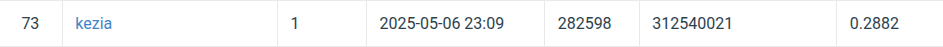

# NYCU-Visual-Recognition-2025-Spring-HW3
StudentID  : 312540021  
Name       : Kezia Nathania (林紀霞)  

## Introduction 
The objective of this homework is to detect and segment individual cells while correctly classifying each instance using Mask R-CNN. To enhance the model's robustness and accuracy, the study incorporates both training data augmentation and test-time augmentation (TTA). The effectiveness of these techniques is evaluated through a series of experiments, highlighting their contribution to improved segmentation performance.

## How to Install
### Clone the repository:  
  git clone https://github.com/Kezia-Nathania/NYCU-Visual-Recognition-2025-Spring-HW3.git  
  cd NYCU-Visual-Recognition-2025-Spring-HW3  
### Install dependencies:  
  pip install -r requirements.txt  
### Run the mask_rcnn_cell_segmentation.ipynb files

## Performance Snapshot

